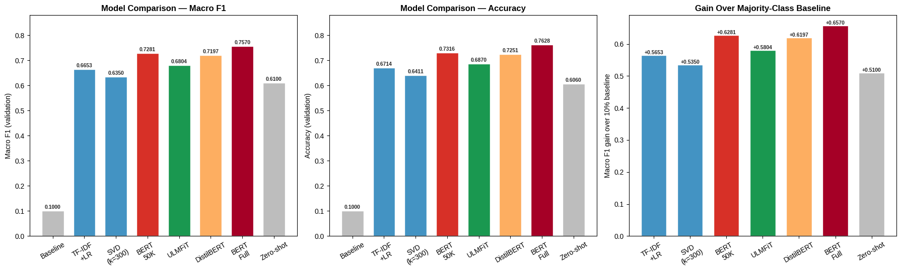
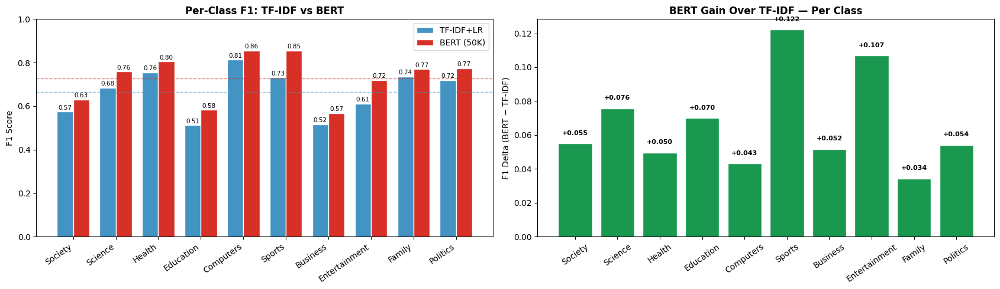

# 🗣️ Can a Machine Know What You’re Talking About?
## Yahoo! Answers Topic Classification with Classical NLP and Transformers

**Course:** CSCE 676 — Data Mining  
**Dataset:** Yahoo! Answers Topic Classification (Zhang et al., 2015)

Yahoo! Answers is noisy, informal, and chaotic in the best way possible—exactly the kind of text that challenges real-world NLP systems. This project builds a complete topic-classification pipeline, starting with strong classical baselines (TF-IDF + Logistic Regression, LSA) and advancing to contextual models (ULMFiT, DistilBERT, BERT, and zero-shot BART), to answer one central question: **Does reading words *in context* matter for topic classification — or is knowing *which* words appear enough?**

---

## 👉 Start Here: [`main_notebook.ipynb`](main_notebook.ipynb)

The main deliverable is **`main_notebook.ipynb`** — a curated, narrative-driven notebook that walks through all nine phases of the project, from environment setup and EDA through every model, cross-validation, and the final conclusions.

---

## 🎥 Project Video

**[▶ Watch the Project Walkthrough on YouTube](https://www.youtube.com/watch?v=b1BY9Ax18tY)**

---

## 🔬 Research Questions

This project is organized around three research questions, each answered by a dedicated modeling stage:

| RQ | Question | Technique | Macro F1 |
|----|----------|-----------|----------|
| **RQ1** | How far can word frequencies alone take us? | TF-IDF + Logistic Regression | **0.6653** |
| **RQ2** | Can compressing features into topics help? | Latent Semantic Analysis (SVD) | 0.6350 |
| **RQ3** | Does reading words in context close the gap? | BERT Fine-Tuning | **0.7281** |

---

## 📂 Dataset

**Name:** Yahoo Answers Topic Classification Dataset  
**Source:** [LC-John/Yahoo-Answers-Topic-Classification-Dataset](https://github.com/LC-John/Yahoo-Answers-Topic-Classification-Dataset)  
**Original paper:** Zhang et al., 2015 — *Character-level Convolutional Networks for Text Classification*

### Structure

Each record contains four fields (no header row in the raw CSV):

| Column | Content | Example |
|--------|---------|---------|
| 1 | Topic label (integer 1–10) | `5` |
| 2 | Question title | *"why doesn't an optical mouse work on glass?"* |
| 3 | Question body | *"or even on some surfaces?"* |
| 4 | Best answer | *"optical sensors need contrast..."* |

### Size

- **Training set:** ~1.4 million samples  
- **Test set:** ~60,000 samples  
- **Classes:** 10 topic categories (Society & Culture, Science & Math, Health, Education & Reference, Computers & Internet, Sports, Business & Finance, Entertainment & Music, Family & Relationships, Politics & Government)

### Downloading the Data

The dataset is too large to commit to this repo. Download it from the source above and place the files at:

```
data/
├── train.csv    # ~1.4M rows, no header
└── test.csv     # ~60K rows, no header
```

The notebook's Phase 2 (Data Loading) will auto-resolve the path when running in Google Colab with Google Drive mounted.

### Preprocessing

All preprocessing is done inside `main_notebook.ipynb` Phase 2. Key steps:
1. **Load CSV files** — Use `pd.read_csv()` with `engine="python"`, `on_bad_lines="skip"`, and `quoting=csv.QUOTE_MINIMAL` to handle embedded newlines in user posts
2. **Assign column names** — Map raw columns to (`label`, `title`, `question`, `answer`)
3. **Missing value audit** — Investigate why 46% of rows have NaN in question/answer fields (root cause: CSV parsing artifacts from embedded newlines)
4. **Drop NaN rows** — Remove rows with NaN in any of the three text fields (reduces 1.4M → ~754K training samples)
5. **Remove exact duplicates** — Drop identical rows; no duplicates found in this dataset
6. **Combine text fields** — Concatenate title + question + answer into a single `text` field (this combined field is used for all downstream modeling)
7. **Map labels** — Convert integer labels (1–10) to human-readable class names (Society & Culture, Science & Math, Health, etc.)
8. **Validate** — Assert zero NaN values remain before modeling begins

---

## ▶️ Reproducibility

This project was developed primarily in **Google Colab** (T4 GPU for transformer training).

### Quick Start

1. Open [Google Colab](https://colab.research.google.com/) and upload (or open from GitHub) `main_notebook.ipynb`
2. Go to **Runtime → Change runtime type → T4 GPU** (required for Phase 7 BERT training)
3. Mount Google Drive and place the dataset files at the path specified in Phase 1
4. Run all cells top to bottom

### Install Dependencies

Run this in the first code cell (already included in the notebook):

```python
!pip install transformers datasets accelerate scikit-learn pandas matplotlib seaborn fastai -q
```

Or install from the full requirements file:

```bash
pip install -r requirements.txt
```

### Export the Colab environment

At the bottom of `main_notebook.ipynb`, run the following so the exact Colab environment is captured and saved into the repo:

```python
!pip freeze > requirements.txt
from google.colab import files
files.download('requirements.txt')
```

### Run Order

| Step | File | Description |
|------|------|-------------|
| 1 | `checkpoints/checkpoint_1.ipynb` | Dataset exploration and selection |
| 2 | `checkpoints/checkpoint_2.ipynb` | Research question formalization |
| 3 | `main_notebook.ipynb` | Full pipeline — EDA through conclusions |

### Runtime note

The long full-dataset BERT training stage is computationally expensive (multi-hour on T4). The final notebook contains reported results and analysis for reproducibility and review.

---

## 🔑 Key Dependencies and Versions

Python version captured via `!python --version`:

- **Python 3.9.6**

Representative core packages (full environment is in [`requirements.txt`](requirements.txt)):

| Package | Version | Used For |
|---------|---------|---------|
| Python | 3.9.6 | Runtime |
| pandas | 2.2.2 | Data loading and manipulation |
| numpy | 2.0.2 | Numerical operations |
| scikit-learn | 1.6.1 | TF-IDF, Logistic Regression, LSA, CV |
| matplotlib | 3.10.0 | Visualizations |
| seaborn | 0.13.2 | Heatmaps and EDA plots |
| scipy | 1.16.3 | Scientific computing utilities |
| transformers | 5.0.0 | BERT, DistilBERT, BART (HuggingFace) |
| datasets | 4.0.0 | HuggingFace dataset utilities |
| accelerate | 1.13.0 | HuggingFace Trainer GPU support |
| torch | >=2.0.0 | PyTorch backend for all neural models |
| fastai | 2.8.7 | ULMFiT / AWD-LSTM |
| tqdm | 4.67.3 | Progress reporting |

The complete list of every package and version from the Colab session lives in [`requirements.txt`](requirements.txt).

---

## 🗂️ Checkpoint Notebooks

| Notebook | Contents |
|----------|----------|
| [`checkpoints/checkpoint_1.ipynb`](checkpoints/checkpoint_1.ipynb) | Three candidate datasets evaluated; Yahoo Answers selected; initial EDA and data quality assessment |
| [`checkpoints/checkpoint_2.ipynb`](checkpoints/checkpoint_2.ipynb) | Research questions formalized; experimental framework designed; hypotheses stated with EDA support |

---

## 📁 Repo Structure

```
yahoo-answers-nlp-project/
│
├── assets/
│   ├── figure_01_f1_per_class.png
│   ├── figure_02_f1_vs_svd.png
│   ├── ...
│   └── figure_11_ulmfit_lr.png
│
├── checkpoints/
│   ├── checkpoint_1.ipynb       # Checkpoint 1: Dataset selection & initial EDA
│   └── checkpoint_2.ipynb       # Checkpoint 2: Research questions & experimental design
│
├── data/
│   └── README_data.md           # Instructions for downloading the dataset
│
├── main_notebook.ipynb          # 👈 Main deliverable — start here
├── README.md                    # This file
└── requirements.txt             # Full dependency list (exported from Colab)
```

---

## 📊 Results Summary

The final notebook makes a clear case for a simple but important conclusion: **contextual language models understand this dataset better than sparse word-frequency features**. The strongest classical baseline, TF-IDF + Logistic Regression, is already competitive, but the transformer models still move the needle further—especially when enough training data is available.

### Main takeaways

- **BERT fine-tuned on the full dataset is the strongest model overall**, reaching **0.757 Macro F1** and **0.763 accuracy**.
- **TF-IDF + Logistic Regression remains a very strong classical baseline**, but BERT improves by about **9 points** in both Macro F1 and accuracy.
- **DistilBERT and BERT with 50K examples** show that contextual features help even when the labeled data budget is much smaller.
- **ULMFiT also performs well**, confirming that sequential context is already useful before moving to transformers.
- **LSA underperforms the TF-IDF baseline**, which is a useful reminder that dimensionality reduction is not automatically better than a sparse representation.
- **Zero-shot BART is a valuable reference point**, but it trails task-specific fine-tuning because this task benefits from domain adaptation.

| Model | Macro F1 | Accuracy | Notes |
|-------|----------|----------|-------|
| Random Baseline | 0.100 | 0.100 | Chance floor |
| LSA (k=300) | 0.635 | 0.641 | Dimensionality reduction does not beat the sparse baseline |
| TF-IDF + LR | 0.665 | 0.671 | Best classical baseline |
| Zero-Shot BART-MNLI | 0.610 | 0.606 | No task-specific training |
| ULMFiT (AWD-LSTM) | 0.680 | 0.687 | Strong sequential model |
| DistilBERT | 0.720 | 0.725 | Efficient contextual encoder |
| BERT (50K examples) | 0.728 | 0.732 | Context helps even with limited data |
| **BERT (Full Dataset)** | **0.757** | **0.763** | **Best overall** |

### Overall model comparison (Macro F1, Accuracy, and gain over baseline)

This figure shows the full leaderboard-style comparison across all models. The same pattern appears on both metrics: TF-IDF is a strong baseline, LSA drops slightly behind it, and the transformer models climb steadily toward the strongest full-dataset BERT result.



### Per-class performance: TF-IDF vs BERT

This per-class view shows where the transformer helps most. BERT produces the largest gains on the hardest labels—especially **Sports**, **Entertainment**, **Science**, and **Politics**—while still improving the rest of the classes in a consistent way.



**Central conclusion:** Context matters—consistently and measurably. The 9-point jump from TF-IDF + Logistic Regression to BERT (full dataset) is not just a leaderboard improvement; it means fewer misrouted questions, better topic assignment, and a stronger practical system for noisy, user-generated text.

---

## ⚠️ Limitations

Even though the notebook delivers strong results, it still has a few important constraints that should be stated clearly:

- **Single-split evaluation:** The main comparison uses one stratified train/validation split for fairness across models. That makes the comparisons easy to read, but it is still less stable than repeated cross-validation across every model.
- **Heavy class-specific context:** Yahoo! Answers posts can be long, noisy, and redundant, which helps contextual models but also means performance may be different on shorter or cleaner text sources.
- **Compute cost:** The strongest transformer runs, especially the full-dataset BERT experiment, are expensive and not ideal for quick experimentation or low-resource environments.
- **Domain dependence:** These results are optimized for the Yahoo! Answers topic space; performance may shift if the data distribution, label set, or writing style changes.
- **No production drift testing:** The notebook focuses on model quality, not long-term drift, latency under load, or real-time monitoring after deployment.

---

## 🚀 Practical Deployment

If this project were turned into a real application, the most practical path would be to keep the notebook logic but package it as a small inference service or batch pipeline.

### Recommended deployment path

- **Fast baseline layer:** Use **TF-IDF + Logistic Regression** as the quickest and cheapest fallback for simple or high-volume routing.
- **Balanced production choice:** Use **DistilBERT** when you want strong quality with lower latency and a smaller memory footprint.
- **Highest-quality offline classifier:** Use **BERT fine-tuned on the full dataset** for batch processing, moderation review queues, or higher-stakes topic routing where accuracy matters most.

### Suggested production workflow

1. Accept a question title, body, and answer as input.
2. Normalize text using the same preprocessing used in `main_notebook.ipynb`.
3. Route through a saved vectorizer/model bundle or a transformer inference endpoint.
4. Return the predicted topic label plus confidence scores.
5. Log predictions and low-confidence examples for review and future retraining.

### What would matter in production

- **Latency:** How fast the model responds per request.
- **Throughput:** How many posts can be handled per minute or hour.
- **Calibration:** Whether the confidence scores reflect reality.
- **Monitoring:** Whether new language, slang, or topic drift changes accuracy over time.
- **Retraining strategy:** How often the model should be refreshed as new data arrives.

---

## 🔮 Future Scope

- **Topic discovery:** Use **BERTopic**, **LDA**, or hybrid clustering to uncover subtopics inside the ten coarse Yahoo! Answers labels and reveal structure that the current label set hides.
- **Stronger semantic encoders:** Compare the current results against **Sentence-BERT**, **modern embedding models**, and **contrastive learning** approaches to see whether retrieval-style semantics can match or exceed fine-tuned classification.
- **Error analysis:** Build a confusion-focused analysis to understand where class overlap still hurts performance, which examples are ambiguous, and whether certain labels are consistently harder to separate.
- **Model efficiency:** Explore **distillation**, **quantization**, and **mixed-precision inference** to reduce the cost of transformer deployment without sacrificing too much quality.
- **Scalability:** Turn the notebook workflow into a reproducible pipeline with cached artifacts, faster data loading, and batch inference for large-scale routing.
- **Robust evaluation:** Test on alternative splits and noisy subsets to measure stability, calibration, and generalization beyond one validation split.

---

## 📚 References

- Devlin, J., Chang, M-W., Lee, K., & Toutanova, K. (2019). BERT: Pre-training of Deep Bidirectional Transformers for Language Understanding. *arXiv:1810.04805*.
- Howard, J., & Ruder, S. (2018). Universal Language Model Fine-tuning for Text Classification. *arXiv:1801.06146*.
- Sanh, V., Debut, L., Chaumond, J., & Wolf, T. (2019). DistilBERT, a distilled version of BERT. *arXiv:1910.01108*.
- Zhang, X., Zhao, J., & LeCun, Y. (2015). Character-level convolutional networks for text classification. *NeurIPS 28*.
- Merity, S., Keskar, N.S., & Socher, R. (2017). Regularizing and Optimizing LSTM Language Models. *arXiv:1708.02182*.
- Lewis, M., et al. (2020). BART: Denoising Sequence-to-Sequence Pre-training. *arXiv:1910.13461*.
